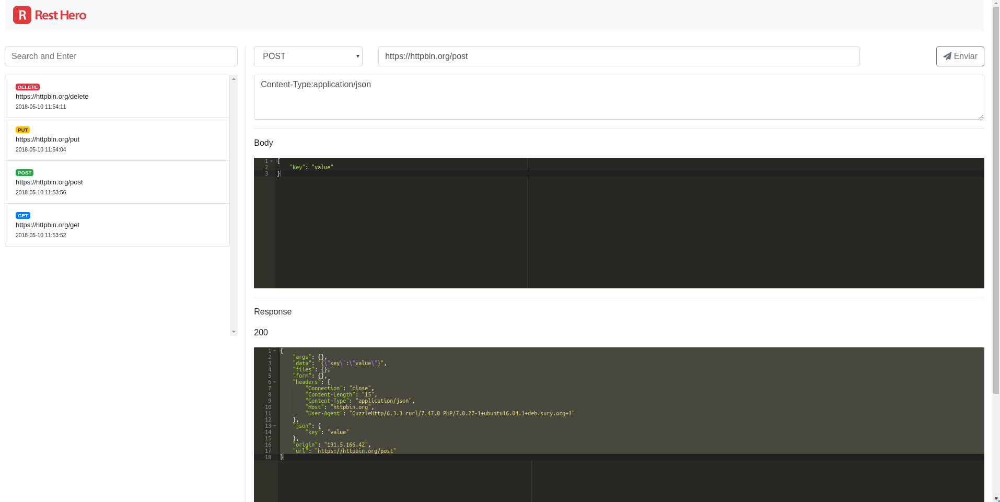

# Rest Hero

[](https://secure.travis-ci.org/zendframework/zend-expressive-skeleton)
[](https://coveralls.io/github/zendframework/zend-expressive-skeleton?branch=master)

*Simple Personal Rest Client to debug REST API's*

Build with [zend-expressive](https://github.com/zendframework/zend-expressive) and 
[Bootstrap](http://getbootstrap.com) to
provide a simple and personal rest client to debug REST API's.

This little app was created to run a local environment, fast and easy to use.

Requests can be made to::
* GET some resource
* POST some resource with or without JSON Body
* PUT some resource with or without JSON Body
* DELETE some resource
    




## Getting Started

Start your Rest Hero with composer:

```bash
$ composer install
```

After installing the packages, go to the
`public` folder and start PHP's internal web server:

```bash
$ php -S localhost:8080
```

You can then browse to http://localhost:8080 and be happy!